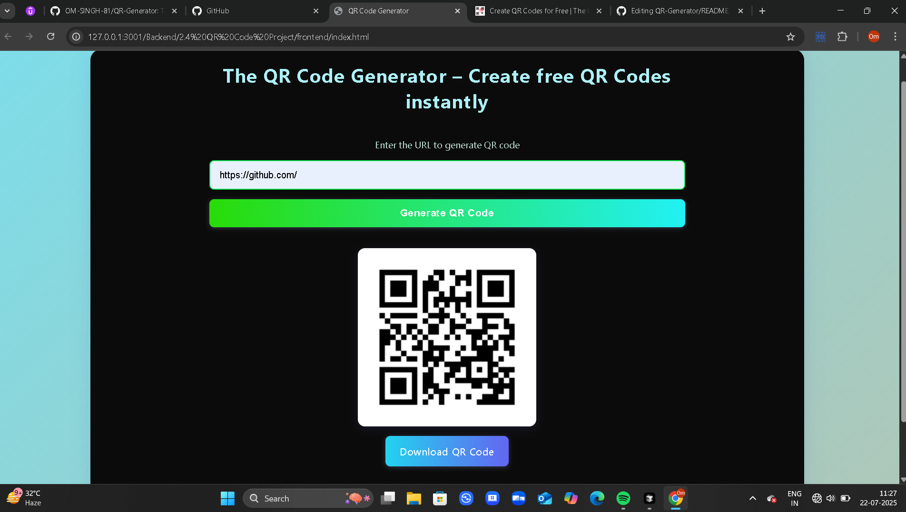

# QR Code Generator

A modern, full-stack QR code generator web app. Instantly create and download QR codes for any URL with a beautiful, responsive interface.

---

## 🚀 Features
- **Instant QR Code Generation:** Enter any URL and generate a QR code instantly.
- **Downloadable QR Codes:** Download your generated QR code as a PNG image.
- **Responsive Design:** Works beautifully on all devices (desktop, tablet, mobile).
- **Modern UI:** Eye-catching color palette, smooth animations, and a clean layout.
- **Full-Stack Solution:** Node.js/Express backend and a static HTML/CSS/JS frontend.

---

## 🖼️ Preview

 <!-- Add a screenshot if available -->

---

## 🧑‍💻 Tech Stack
- **Frontend:** HTML, CSS (Flexbox, Media Queries), JavaScript (Fetch API)
- **Backend:** Node.js, Express, qr-image, CORS

---

## 📦 Project Structure
```
Backend/2.4 QR Code Project/
│
├── index.js           # Express backend (API for QR code generation)
├── package.json       # Backend dependencies
├── .gitignore         # Ignore node_modules, generated files
├── frontend/
│   ├── index.html     # Main frontend UI
│   ├── style.css      # Responsive, animated styles
│   └── script.js      # Handles API requests and QR code display
└── ...
```

---

## ⚙️ Setup & Usage

### 1. **Clone the Repository**
```sh
git clone https://github.com/OM-SINGH-81/QR-Generator.git
cd QR-Generator/Backend/2.4\ QR\ Code\ Project
```

### 2. **Install Backend Dependencies**
```sh
npm install
```

### 3. **Start the Backend Server**
```sh
node index.js
```
- The backend will run at `http://localhost:3000` by default.

### 4. **Open the Frontend**
- Open `frontend/index.html` in your browser.
- Enter a URL, click **Generate QR Code**, and download your QR code instantly!

---

## 🛠️ API Reference

### **POST /generate**
- **Body:** `{ "url": "https://example.com" }`
- **Response:** PNG image of the QR code

---

## ✨ Customization
- Change colors, fonts, or layout in `frontend/style.css`.
- Update backend port or features in `index.js`.

---

## 📄 License
This project is open source and available under the [ISC License](../LICENSE) (or specify your license).

---

## 🙌 Credits
- [qr-image](https://www.npmjs.com/package/qr-image)
- [Express](https://expressjs.com/)
- [CORS](https://www.npmjs.com/package/cors)

---

## 💡 What I Learned
- Building a full-stack app from scratch
- Creating and serving images dynamically with Node.js
- Responsive, animated frontend design
- Connecting frontend and backend via API

---

## 📬 Feedback
Feel free to open issues or pull requests for suggestions and improvements! 